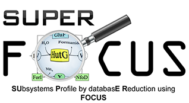

### SUPER-FOCUS: A tool for agile functional analysis of metagenomic data
* [Installation](#installation)
* [Dependencies](#dependencies)
* [Aligners](#aligners)
* [Download SUPER-FOCUS Database](#database)
* [Running SUPER-FOCUS](#run)
* [General Recomendations](#recomendations)
* [Ouput](#output)
* [Citing](#citing)


## Installation
This will give you command line program:

	pip install superfocus

or

	# clone super-focus
	git clone https://github.com/metageni/SUPER-FOCUS.git

	# install super-focus
	cd SUPER-FOCUS && python setup.py install

	# if you do not have super user privileges, you can install it like this
	cd SUPER-FOCUS && python setup.py install --user

## Dependencies
- [Python 3.6](http://www.python.org/download)
- [Numpy 1.12.1](https://github.com/numpy/numpy)
- [SciPy 0.19.0](https://github.com/scipy/scipy)

## Aligners
One of the below aligners:
- [DIAMOND 0.9.14](http://ab.inf.uni-tuebingen.de/software/diamond)
- [RAPSearch2 2.24](http://rapsearch2.sourceforge.net)
- [BLAST 2.6.0](https://blast.ncbi.nlm.nih.gov/Blast.cgi?CMD=Web&PAGE_TYPE=BlastDocs&DOC_TYPE=Download)


## Database
Use `superfocus_downloadDB` to download and format the SUPER-FOCUS database
for the available aligners:

```
superfocus_downloadDB -a <aligner>
```
where `<aligner>` is `rapsearch`, `diamond`, or `blast` (or all of them separated by `,`). You
may choose as many aligners as you want among the three, as long as they are
installed.

**NOTE**: RAPSearch2 and DIAMOND won't work properly if you are trying to use a
database formatted with an incorrect version of the aligner. Thus, please
re-run `superfocus_downloadDB` in case any aligner was updated on your
system.


## Run
The main SUPER-FOCUS program is `superfocus`. Here is a list of the
available command line options:

	-h print help

	-q FASTA/FASTQ
		Path to directory with FASTA/FASTQ file(s)

	-dir string
		output directory

	-o string
		output prefix (default 'output_')

	-mi float
		minimum identity (default 60 %)

	-ml int
		minimum alignment (amino acids) (default: 15)

	-focus int
		runs FOCUS; 1 does run; 0 does not run: default 0

	-t int
		number of threads (default 4)

	-e float
		e-value (default 0.00001)

	-db string
		database (DB_90, DB_95, DB_98, or DB_100; default DB_90)

	-p int
		amino acid input; 0 nucleotides; 1 amino acids (default 0)

	-a string
		aligner choice (rapsearch (only fasta files) or diamond; default rapsearch)

	-fast int
		runs RAPSearch2 or DIAMOND on fast mode - 0 (False) / 1 (True) (default: 1)

	-n int
		normalizes each query counts based on number of hits; 0 doesn't normalize; 1 normalizes (default: 1)

	Usage example: superfocus -q query.fasta -dir output_dir

## Recomendations
- The FOCUS reduction is not necessary if not wanted (it is off by default: set `-focus 1` to run FOCUS reduction)
- Run RAPSearch for short sequences, it is less sensitive for long sequences
- Primarily use DIAMOND for large datasets only. It is slower than blastx for small datasets
- BLAST is known for being really slow

## Output
SUPER-FOCUS output will be add the folder selected by the `-dir` argument.

## Citing
SUPER-FOCUS was written by Genivaldo G. Z. Silva. Feel free to [contact me](mailto:genivaldo.gueiros@gmail.com)

If you use SUPER-FOCUS in your research, please cite:

    Silva, G. G. Z., Green K., B. E. Dutilh, and R. A. Edwards:
    SUPER-FOCUS: A tool for agile functional analysis of shotgun metagenomic data.
	Bioinformatics. 2015 Oct 9. pii: btv584. Website: https://edwards.sdsu.edu/SUPERFOCUS
