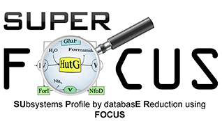

### SUPER-FOCUS: A tool for agile functional analysis of metagenomic data
* [Installation](#installation)
* [Dependencies](#dependencies)
* [Aligners](#aligners)
* [Download SUPER-FOCUS Database](#database)
* [Running SUPER-FOCUS](#run)
* [General Recomendations](#recomendations)
* [Ouput](#output)
* [Citing](#citing)

## Is SUPER-FOCUS right for you?
This [blog post](https://onestopdataanalysis.com/metagenome-functional-profile/) talks about SUPER_FOCUS. Please read it and make sure the tool is right for you.

## Installation
This will give you command line program:

	# clone super-focus
	git clone https://github.com/metageni/SUPER-FOCUS.git

	# install super-focus
	cd SUPER-FOCUS && python setup.py install

	# if you do not have super user privileges, you can install it like this
	cd SUPER-FOCUS && python setup.py install --user


## Dependencies
- [Python >= 3.6](http://www.python.org/download)
- [Numpy 1.12.1](https://github.com/numpy/numpy)
- [SciPy 0.19.0](https://github.com/scipy/scipy)  

If you have Python 3.6, you can install both dependencies with:  
`pip3 install -r requirements.txt`

## Aligners
One of the below aligners, which can easily be installed with [`conda`](https://conda.io/docs/):
- [DIAMOND 0.9.14](http://ab.inf.uni-tuebingen.de/software/diamond)
- [MMSEQS2](https://github.com/soedinglab/MMseqs2)

To install the aligners, having [`conda`](https://conda.io/docs/installation.html) installed, simply run:  
 `conda install -c bioconda <aligner>`

 Note that they are all available from the [`bioconda`](https://bioconda.github.io/) channel.

## Database

If you have the superfocus databases downloaded already, you can set the `SUPERFOCUS_DB` environment variable to point
to that directory. Alternatively, you can provide the `--alternate_directory` flag to point to that location.

### Downloading prebuilt databases

We have prebuilt databases for both supported aligners. Download the one matching your aligner and cluster size.

***Diamond***

Please check your `diamond` version with `diamond --version` and then read the [diamond documentation](https://github.com/bbuchfink/diamond/wiki/5.-Advanced-topics#database-format-versions) to know which version to download. You can also find out the database version you have installed with `diamond dbinfo`.

Cluster Size | diamond version 1 databases | diamond version 2 databases | diamond version 3 databases
--- | --- | --- | ---
90 |  [90 v1](https://open.flinders.edu.au/ndownloader/files/44075159) | [90 v2](https://open.flinders.edu.au/ndownloader/files/44075207)  | [90 v3](https://open.flinders.edu.au/ndownloader/files/44075225) 
95 |  [95 v1](https://open.flinders.edu.au/ndownloader/files/44075153) | [95 v2](https://open.flinders.edu.au/ndownloader/files/44075201)  | [95 v3](https://open.flinders.edu.au/ndownloader/files/44075231) 
98 |  [98 v1](https://open.flinders.edu.au/ndownloader/files/44075156)  | [98 v2](https://open.flinders.edu.au/ndownloader/files/44075204)  | [98 v3](https://open.flinders.edu.au/ndownloader/files/44075234) 
100 |  [100 v1](https://open.flinders.edu.au/ndownloader/files/44075165)  | [100 v2](https://open.flinders.edu.au/ndownloader/files/44075210)  | [100 v3](https://open.flinders.edu.au/ndownloader/files/44075228) 

After downloading, unzip into `db/static/diamond/` in the same location as superfocus:

```bash
mkdir -p  $(which superfocus | sed -e 's#bin/superfocus$#lib/python3.8/site-packages/superfocus_app/db/static/diamond#') &&
unzip -d  $(which superfocus | sed -e 's#bin/superfocus$#lib/python3.8/site-packages/superfocus_app/db/static/diamond#') 90_clusters.db.dmnd.zip
```

***MMSEQS2***

There is only one version of the MMSEQS2 databases.

Cluster Size | mmseqs2 databases
--- | ---
90 |  [mmseqs_90.zip](https://open.flinders.edu.au/ndownloader/files/44075237)
95 |  [mmseqs_95.zip](https://open.flinders.edu.au/ndownloader/files/44075240)
98 |  [mmseqs_98.zip](https://open.flinders.edu.au/ndownloader/files/44075243)

After downloading, unzip into `db/static/mmseqs2/` in the same location as superfocus:

```bash
mkdir -p  $(which superfocus | sed -e 's#bin/superfocus$#lib/python3.8/site-packages/superfocus_app/db/static/mmseqs2#') &&
unzip -d  $(which superfocus | sed -e 's#bin/superfocus$#lib/python3.8/site-packages/superfocus_app/db/static/mmseqs2#') mmseqs_90.zip
```

## Run
The main SUPER-FOCUS program is `superfocus`. Here is a list of the
available command line options:

```
Usage: superfocus [OPTIONS]

  SUPER-FOCUS: agile functional analysis of shotgun metagenomic data.

Options:
  -v, --version                   Show the version and exit.
  -q, --query TEXT                Path to FAST(A/Q) file or directory. Repeatable.  [required]
  -dir, --output_directory TEXT   Path to output directory.  [required]
  -o, --output_prefix TEXT        Output file prefix.  [default: output_]
  -a, --aligner TEXT              Aligner: diamond or mmseqs2.  [default: diamond]
  -db, --database TEXT            Database: DB_90, DB_95, DB_98, or DB_100.  [default: DB_90]
  -e, --evalue TEXT               E-value threshold.  [default: 0.00001]
  -t, --threads TEXT              Number of threads.  [default: 4]
  -mi, --minimum_identity FLOAT   Minimum percent identity.  [default: 60.0]
  -ml, --minimum_alignment INT    Minimum alignment length (amino acids).  [default: 15]
  -f, --fast TEXT                 Fast mode: 1 (fast) or 0 (sensitive).  [default: 1]
  -p, --amino_acid TEXT           Input type: 0 nucleotides, 1 amino acids.  [default: 0]
  -n, --normalise_output INT      Normalise counts: 1 yes, 0 no.  [default: 1]
  -m, --focus TEXT                Run FOCUS reduction: 1 yes, 0 no.  [default: 0]
  -b, --alternate_directory TEXT  Alternate directory for databases.
  -d, --delete_alignments         Delete alignment files after parsing.
  -s, --subsample INTEGER         Subsample reads to this count.
  -w, --latency_wait INTEGER      Seconds to wait after alignment (NFS latency).  [default: 0]
  -tmp, --temp_directory TEXT     Alternate temporary directory.
  -l, --log TEXT                  Path to log file (default: STDOUT).
  -h, --help                      Show this message and exit.
```

    superfocus -q input_folder -dir output_dir

## Query

The query can be one or more fasta or fastq files, or a directory containing those files. We filter for
files that end `.fasta`, `.fastq`, or `.fna`, so please ensure any file that you want processed has one
of those file extensions.

You can provide a mixture of input files or directories, and we will filter the files as appropriate.

For example:

```bash
superfocus -q fastq1.fastq -q fastq2.fastq -q directory/ -dir output
```

will process the two fastq files `fastq1.fastq` and `fastq2.fastq` as well as any `fasta` or `fastq` files in `directory`
and put the output in `output`.

We currently do not handle `gzipped` or otherwise compressed input files.

## Recomendations
- The FOCUS reduction is not necessary if not wanted (it is off by default: set `-focus 1` to run FOCUS reduction)
- Primarily use DIAMOND for large datasets
- Run mmseqs2 if you are running multiple jobs in parallel (e.g. on a cluster)
- **Concurrent jobs are safe**: multiple SUPER-FOCUS jobs can share the same output directory without conflict. Alignment files are namespaced by process ID, and each run uses its own isolated temporary directory.

## Output
SUPER-FOCUS output will be add the folder selected by the `-dir` argument.

## Testing

The test suite covers unit tests and end-to-end CLI integration tests for each supported aligner.

### Run all tests
```bash
pytest tests/
```

### Run only integration tests (requires diamond, mmseqs2 installed)
```bash
pytest -m integration
```

Integration tests invoke the `superfocus` CLI against pre-built fixture databases in `tests/fixtures/` and assert that all expected output files are produced with hits.

**Supported aligners tested:** diamond, mmseqs2

## Citing
SUPER-FOCUS was written by Genivaldo G. Z. Silva. Feel free to create an [issue or ask questions](https://github.com/metageni/SUPER-FOCUS/issues)

If you use SUPER-FOCUS in your research, please cite:

#### Paper

    Silva, G. G. Z., Green K., B. E. Dutilh, and R. A. Edwards:
    SUPER-FOCUS: A tool for agile functional analysis of shotgun metagenomic data.
	Bioinformatics. 2015 Oct 9. pii: btv584. 

#### Extended tool manual
    Silva, G. G. Z., F. A. Lopes, and R. A. Edwards
    An Agile Functional Analysis of Metagenomic Data Using SUPER-FOCUS.
	Protein Function Prediction: Methods and Protocols, 2017.
